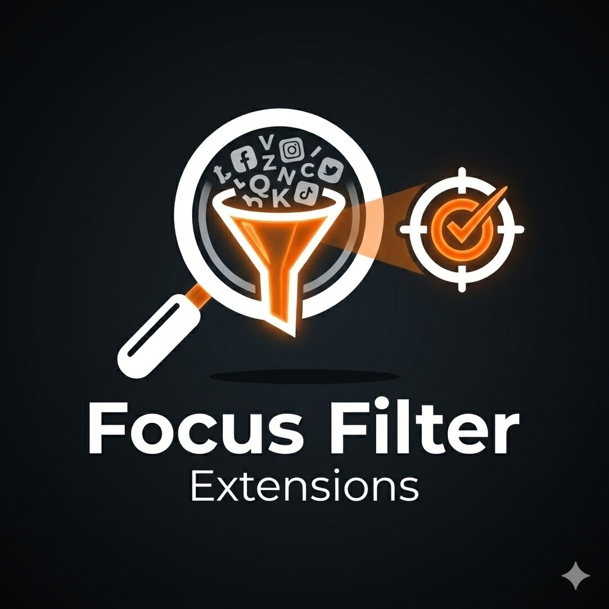
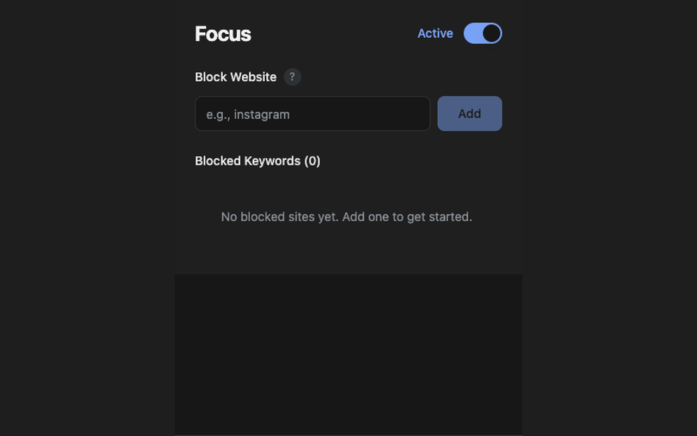
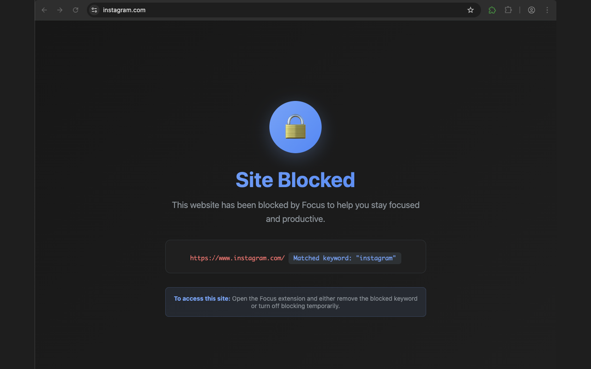

<div align="center">
  

  # Focus Filter Extension

  **Regain your attention. Block distractions. Stay Flow.**

  [](https://opensource.org/licenses/MIT)
  
  
  
  
  [](http://makeapullrequest.com)

  <p align="center">
    <a href="#-features">Features</a> •
    <a href="#-installation">Installation</a> •
    <a href="#-development">Development</a> •
    <a href="#-contributing">Contributing</a>
  </p>
</div>

---

## 🚀 Overview

**Focus Filter** is a beautiful, minimalist Chrome extension designed to help you maintain deep work states by blocking distracting websites. Unlike other blockers that are complicated or intrusive, Focus Filter uses a clean **Material 3 Dark Theme** and simple **keyword-based blocking** to keep your browsing unintentional-free.

No tracking. No data collection. Just pure focus.

## ✨ Features

- **🔍 Smart Keyword Blocking**: Type "gram" and block `instagram.com`, `telegram.org`, or any URL containing the keyword.
- **🌗 Beautiful Dark Mode**: A stunning, eye-friendly UI inspired by Google's Material 3 design system.
- **⚡️ Zero-Latency**: Runs instantly at `document_start` to prevent distractions before they load.
- **🛡️ Privacy First**: 100% local processing. Your data never leaves your browser.
- **🎯 Global Focus Toggle**: One distinct switch to turn "Focus Mode" on or off instantly.
- **🛑 Gentle Interventions**: A calming, aesthetically pleasing "Site Blocked" page that reminds you to get back on track.

## 📸 Screenshots

| **Focus Control Center** | **The Field (Blocked Page)** |
|:---:|:---:|
|  |  |

## 🛠 Tech Stack

Built with the modern web extension stack:

- **Framework**: [WXT](https://wxt.dev/) (Next-gen Extension Framework)
- **Frontend**: React 19 + TypeScript
- **Styling**: Tailwind CSS v3 + Shadcn UI (Atomic Design)
- **Testing**: Vitest for robust logic verification
- **State**: Chrome Storage API (Local)

## 📦 Installation

### Chrome Web Store
*(Coming Soon - You can link your store URL here once published)*

### Manual Installation (Developer API)
1. Download the latest release `.zip` or build from source.
2. Open Chrome and navigate to `chrome://extensions/`.
3. Toggle **Developer mode** in the top right.
4. Drag and drop the `.zip` file OR click **Load unpacked** and select the `.output/chrome-mv3` folder.

## 💻 Development

Want to hack on Focus Filter? We'd love your help!

### Prerequisites
- Node.js 22+ (Check `.nvmrc`)
- npm or yarn

### Setup
```bash
# 1. Clone the repo
git clone https://github.com/yourusername/focus-filter-extension.git

# 2. Install dependencies
npm install

# 3. Start Dev Server (Hot Reload)
npm run dev
```
> The extension will auto-reload as you edit files!

### Building
```bash
npm run build     # Build for production
npm run zip       # Create a publishable .zip file
```

### Testing
```bash
npm test          # Run unit tests
npm test:ui       # Run tests with visual UI
```

## 🤝 Contributing

We welcome contributions from the community! Whether it's fixing a bug, adding a requested feature, or improving documentation, your help is appreciated.

Please see our [CONTRIBUTING.md](CONTRIBUTING.md) for full details on how to get started.

1. Fork the repository
2. Create your feature branch (`git checkout -b feature/AmazingFeature`)
3. Commit your changes (`git commit -m 'Add some AmazingFeature'`)
4. Push to the branch (`git push origin feature/AmazingFeature`)
5. Open a Pull Request

## 🗺 Roadmap

- [x] MVP Release (Keyword blocking, Toggle, UI)
- [ ] 🕒 Scheduled Blocking (Work hours only)
- [ ] ⏳ Pomodoro Timer Integration
- [ ] 📊 Usage Analytics (Local only)
- [ ] 🔐 Password Protection for Settings
- [ ] 🌍 Localization Support

## 📄 License

Distributed under the MIT License. See `LICENSE` for more information.

---

<div align="center">
  <b>Built with ❤️ by Focus Filter Team</b>
</div>
